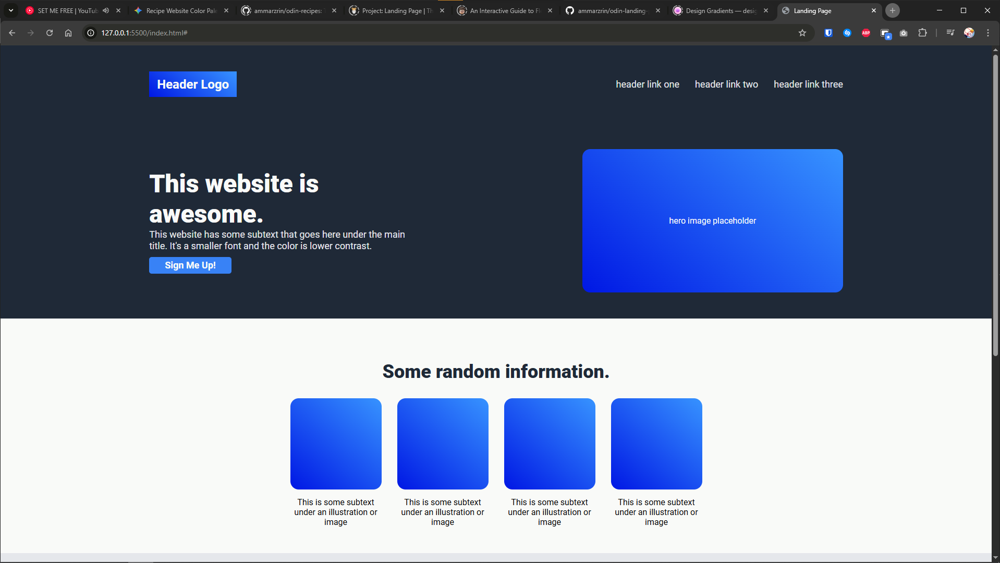
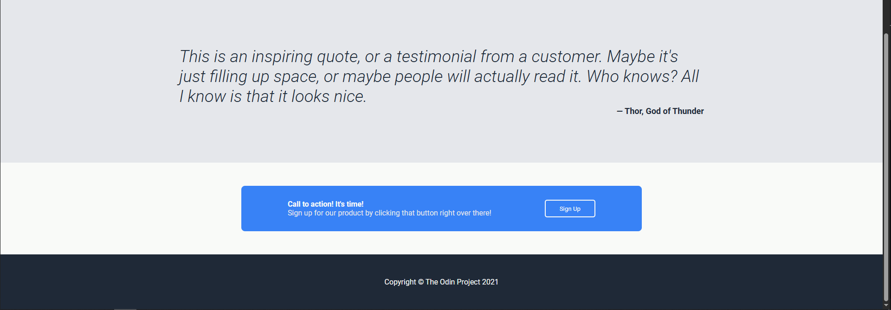
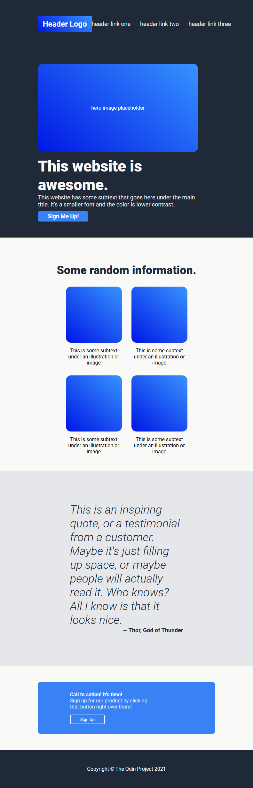

# odin-landing-page

A Landing Page project to practice HTML &amp; CSS mastery by replicating a UI design for a mock business landing page.

## 8 April 2026, 10:49

Copied all content from reference image into HTML and ready to apply CSS and adjust as needed.

## 8 April 2026, 17:36 - 18:39

Applied CSS to the Header and Hero Section content. Quite challenging applying flexbox from scratch. Requires good layout planning skills during HTML writing.

## 8 April 2026, 23:30 - 00:30

Done with the second section, played with flex wrap and reorganising previous code for better layout and responsive design. Getting the hang of Flexbox now.

## 9 April 2026, 11:30 - 12:10

Much better understanding of combining the box model and flexbox to organise elements. Completed the 3rd section.

## 9 April 2026, 12:10 - 12:55

Finished the landing page project as per the requirements to follow the reference image. Added alongside are responsive design techniques using flexbox properties. A bit of creative flair added but still following content from reference image.

### Reference Images

### My Results

